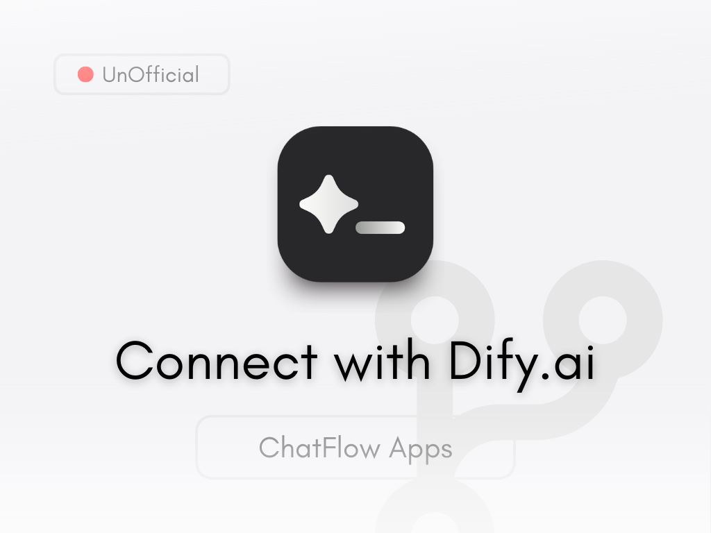

# Diface - Dify AI ChatFlow Interface



Difaceは、[Dify.ai](https://dify.ai)で作成されたAIアプリケーションとシームレスに対話するためのユーザーフレンドリーなインターフェースです。

## 特徴

- **簡単接続**: Dify APIキーを使用して、あなたのAIアプリケーションに即座に接続
- **リアルタイムストリーミング**: AIレスポンスのリアルタイムストリーミングでシームレスな会話を実現
- **ファイル処理**: 画像や文書を簡単にアップロードして分析
- **マルチモーダル対応**: テキスト、画像、ファイルを組み合わせた複合的な対話
- **ワークフロー追跡**: AIの思考プロセスを可視化
- **レスポンシブデザイン**: すべてのデバイスで最適な表示を実現
- **フィードバックシステム**: AIレスポンスに対するフィードバックを通じて改善を促進
- **セッション管理**: 複数のAPIキーと会話を簡単に切り替え

## 使い方

1. [Dify.ai](https://dify.ai)でアカウントを作成しAPIキーを取得
2. そのAPIキーをDifaceに入力して接続
3. 会話を開始

## ローカル環境での実行

```bash
# リポジトリをクローン
git clone https://github.com/lnkiai/diface.git
cd diface

# 依存関係のインストール
npm install

# 開発サーバーの起動
npm run dev
```

## デプロイ

Difaceは静的ウェブアプリケーションであり、次のサービスを含む任意のホスティングプラットフォームにデプロイできます:

- Vercel
- Netlify
- GitHub Pages
- Firebase Hosting

## 技術スタック

- React
- TypeScript
- Vite
- Tailwind CSS
- Server-Sent Events (SSE)

## ライセンス

MIT License - 詳細は[LICENSE](LICENSE)ファイルを参照してください。

## 貢献

1. フォークしてください
2. 機能ブランチを作成してください (`git checkout -b feature/amazing-feature`)
3. 変更をコミットしてください (`git commit -m 'Add some amazing feature'`)
4. ブランチにプッシュしてください (`git push origin feature/amazing-feature`)
5. プルリクエストを開いてください

## お問い合わせ

質問やサポートが必要な場合は、Issueを作成するか、[こちら](https://github.com/lnkiai/d.ai/issues)からお問い合わせください。
```

## Difaceサービスの情報と特徴（日本語版）

### Difaceの概要
Difaceは、Dify.aiで作成されたAIアプリケーションと簡単に対話するためのユーザーインターフェースです。ユーザーはDify APIキーを入力するだけで、カスタムAIチャットボットとの対話を即座に開始できます。

### 主な特徴

1. **シンプルな接続方法**
   - Dify APIキーを入力するだけで即座に接続
   - 複数のAPIキーを管理し、簡単に切り替え可能

2. **高度なチャット機能**
   - リアルタイムレスポンスストリーミング
   - 会話履歴の自動保存と復元
   - 提案質問によるスムーズな対話促進

3. **マルチモーダル対応**
   - テキスト入力に加え、画像やドキュメントのアップロード機能
   - カメラからの直接画像撮影機能
   - 様々なファイル形式（PDF、Word、Excel、テキストなど）の対応

4. **AIワークフロー可視化**
   - 処理ステップのリアルタイム表示
   - トークン使用量や処理時間の透明な表示
   - AIの思考プロセスの可視化

5. **ユーザー体験の向上**
   - レスポンシブデザインでモバイルからデスクトップまであらゆるデバイスに対応
   - ダークモードとライトモード
   - フィードバックシステムによるAI応答品質の向上
   - コピー、再生成などの便利な機能

6. **セキュリティとプライバシー**
   - クライアントサイドのみでの動作（サーバー不要）
   - ローカルストレージでの暗号化されたセッション管理
   - APIキーの安全な取り扱い

Difaceは、Dify.aiの強力なAIアプリケーション作成機能と直感的なユーザーインターフェースを組み合わせることで、AIとの対話をより簡単でアクセスしやすいものにします。技術的な知識がなくても、高度なAIアシスタントの能力を活用できる橋渡しの役割を果たします。
